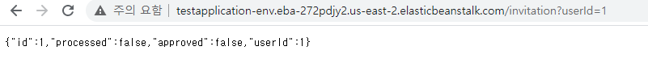

# Elastic BeanStalk

**목적**

aws의 orchestration service이다. Elastic Beanstalk를 사용하면 애플리케이션을 실행하는 인프라에 대해 자세히 알지 못해도 AWS 클라우드에서 애플리케이션을 신속하게 배포하고 관리할 수 있다. 애플리케이션을 업로드하기만 하면 Elastic Beanstalk에서 용량 프로비저닝, 로드 밸런싱, 조정, 애플리케이션 상태 모니터링에 대한 세부 정보를 자동으로 처리한다.

어플리케이션 버전 관리를 통해, 문제가 발생 시, 이전 배포 이력을 통해 재배포도 가능하다.

**구성 파악**

여러 개의 서비스들(ec2, rds, vpc ...)을 컴포넌트로 활용하는 상위 호환 컴포넌트이다. 기본적인 어플리케이션을 구성하는데 다음과 같이 사용된다.

ec2 : 배포 인스턴스

rds : 데이터베이스

vpc : 보안 / 접근 제어

rds 없이도 배포가 가능하나, db 접근 없는 어플리케이션은 공부의 의미가 없으므로, rds도 포함한다.

테스트로 진행한 Configuration 정보이다.

인스턴스: t2-nano (ec2 서비스)

플랫폼 : Amazon Corretto 11(java 프로덕션에 사용)

데이터베이스 : mysql, db.t2.micro (rds 서비스)

로드 밸런서, 모니터링, 알림은 이후에 추가해 보도록 하겠다.

**플랫폼**

springboot로 제작한 프로덕션을 배포할 것이다. springboot는 tomcat 환경이 아닌 embedded-tomcat 을 사용하므로, springboot 어플리케이션 자체는 java 플랫폼에서 동작한다. 따라서 플랫폼 환경을 tomcat이 아닌 java 프로덕션 환경으로 설정한다. 

**업로드**

간단한 샘플 프로젝트를 빌드한다.

이 때, 배포 방법은 2가지가 있는데, jar 파일 하나만 업로드 하거나, 프로젝트 자체를 zip파일로 해야하는데, 후자의 방법이 잘 되지 않아서 jar 파일만 업로드하였다. 

또한, 파일 업로드 시에 많은 시간이 소요되므로, 반응이 오지 않아도 배포될때까지 기다린다. 

**환경변수**

소프트웨어 탭에 가면 ec2 환경변수 제어가 가능한데, 여기서 spring_profiles_active 설정도 가능하여 phase별로 프로퍼티 관리가 가능하다.

**502 nginx bad gateway**

업로드를 하면 다음과 같은 오류가 발생하는데, 서버포트가 일치하지 않아 발생하는 오류다. 기본적으로 beanstalk은 port 8080이고, springboot도 default port가  동일한데, property 파일에 5000으로 설정하는 바보같은 짓을 저질렀다.(실습에 더 도움이 되고자....^^)

아무튼 , 스프링 환경과 맞춰야 하므로 beanstalk 환경설정에서 다음 을 추가한다.

SERVER_PORT=5000

**500 Internal error**

이젠, 제대로 된 접근이 되는 상태이다. 하지만, jdbc exception이 발생하여 서버가 뻗는 케이스이다. 이유는 간단하다. 생성한 beanstalk 프로젝트에는 당연히 db 설정이 되어있지 않다. localhost로 connection을 생성했으니 같은 ec2 인스턴스 내에 db가 설정되어있지 않으므로, 오류가 발생한다. ec2 로컬에 같이 db를 놓으면 해결되지만 그렇게 하면 elastic beanstalk을 쓰는 의의가 약화되므로, 그럴바엔 그냥 ec2를 쓰는게 낫다.

 같은 환경 내 db 생성 or h2 인메모리 db 활용 2가지 꼼수(?)가 있는데 aws 환경을 이해하는 실습이므로 2가지 선택지는 포기하고, beanstalk에서 제공하는 rds 서비스를 사용해 볼 것이다.

**rds 원격 연결**

rds의 서비스 vpc보안그룹에서  인바운드 규칙을 변경해야 한다. beanstalk으로 rds 인스턴스가 생성될 때 기본적으로 인바운드를 모든 사용자에게 열어주지 않기 때문에 직접 들어가서 옵션을 수정해야 한다.- 모든 사용자에 대해 허용 하기

ddl true로 해놓았기 때문에 테이블은 자동 생성 되며 rds에 스키마만 생성해놓자!

다음과 같이 datasource 엔드포인트를 변경해주자.

```yaml
#spring.datasource.url=jdbc:mysql://localhost:3306/report_troll?serverTimezone=UTC&useSSL=false
spring.datasource.url=jdbc:mysql://aavck03jl1b62e.cdozewo4ksn1.us-east-2.rds.amazonaws.com/ebdb?serverTimezone=UTC&useSSL=false
spring.datasource.username=springstudent
spring.datasource.password=springstudent
spring.datasource.driver-class-name=com.mysql.cj.jdbc.Driver

spring.jpa.database = MYSQL
spring.jpa.show-sql = true
spring.jpa.generate-ddl=true
```

다음과 같이 출력이 잘 되는것을 확인할 수 있다.

